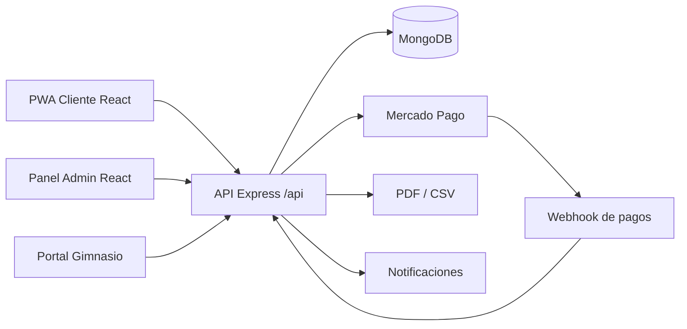
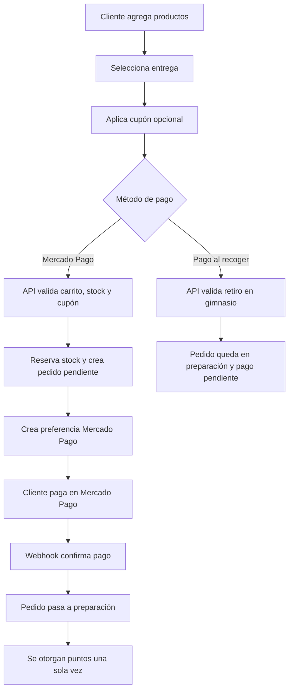
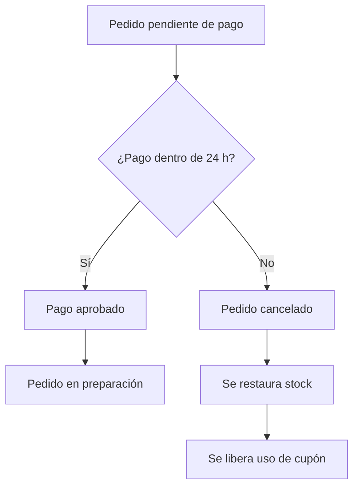
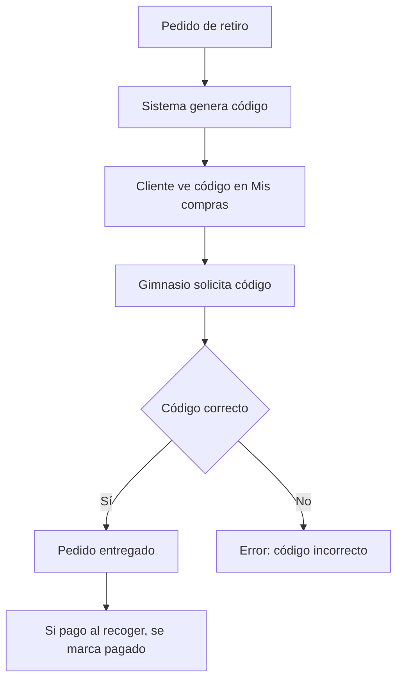
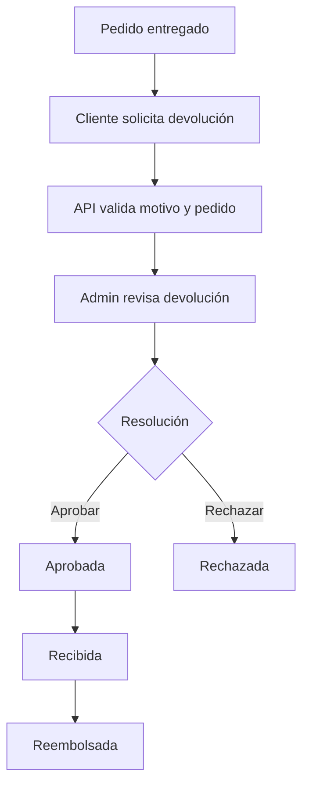
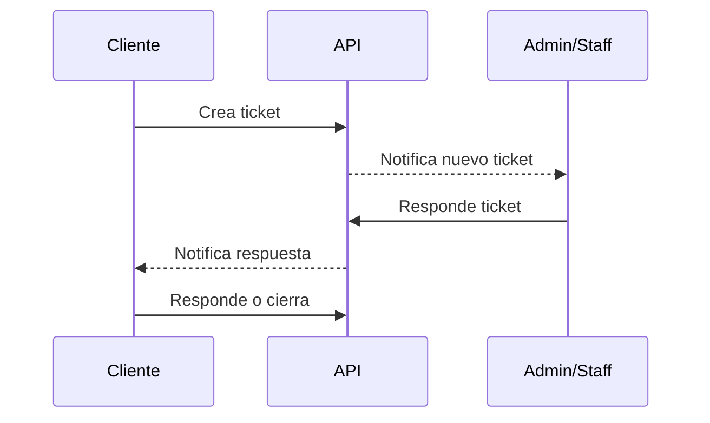
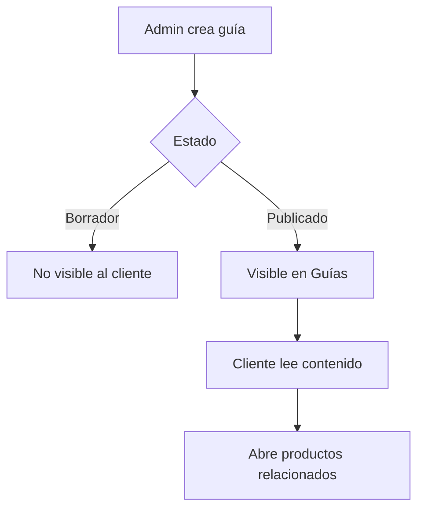
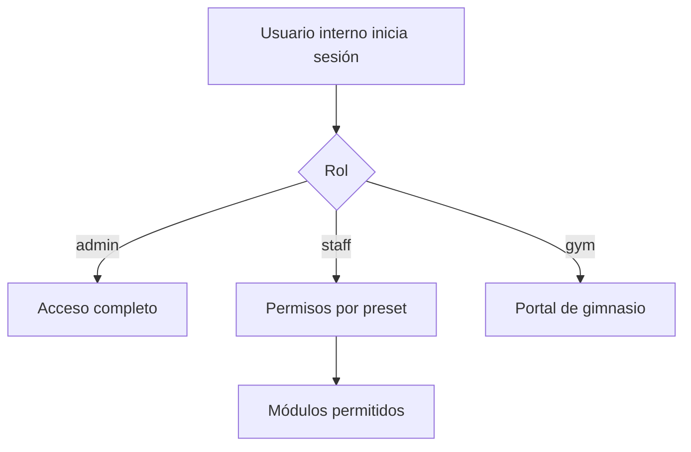
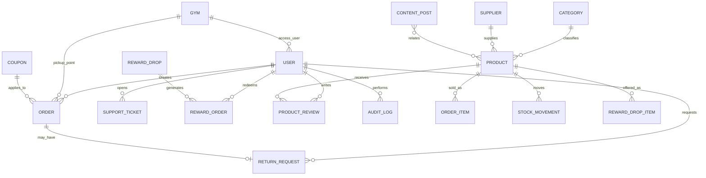

# Diagramas - GymVerse

## 1. Arquitectura general

## 2. Flujo de compra con Mercado Pago

## 3. Flujo de pedido pendiente

## 4. Flujo de retiro en gimnasio

## 5. Flujo de devoluciones

## 6. Flujo de soporte

## 7. Flujo de contenido

## 8. Flujo de permisos admin

## 9. Diagrama entidad-relación

