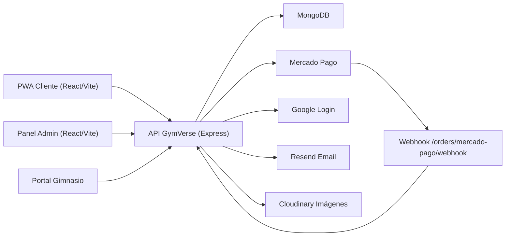
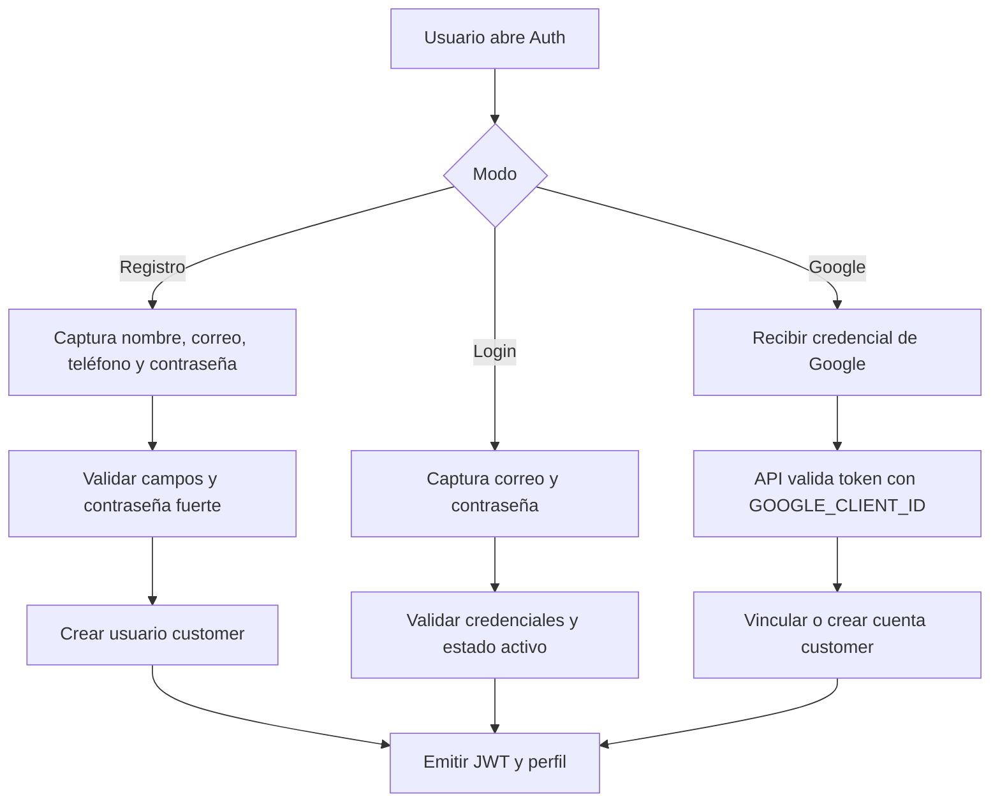
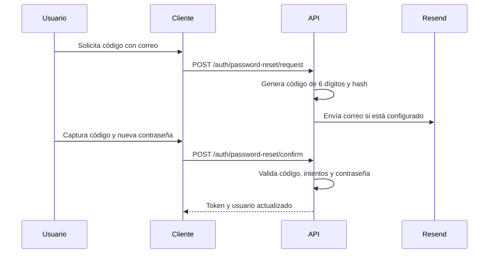
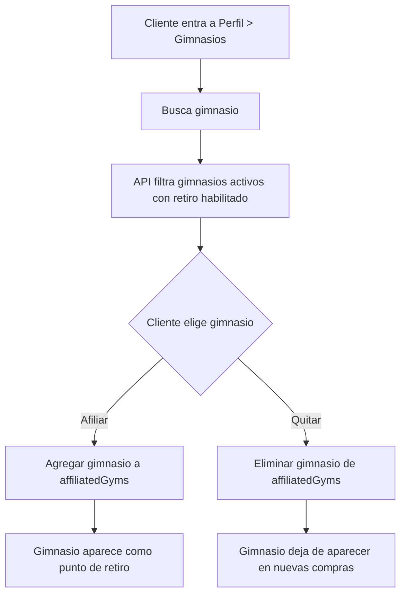
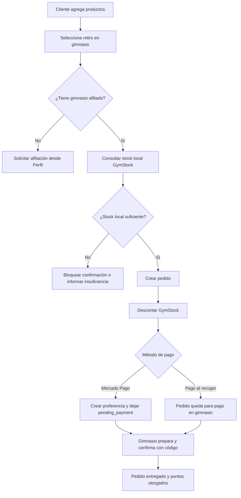
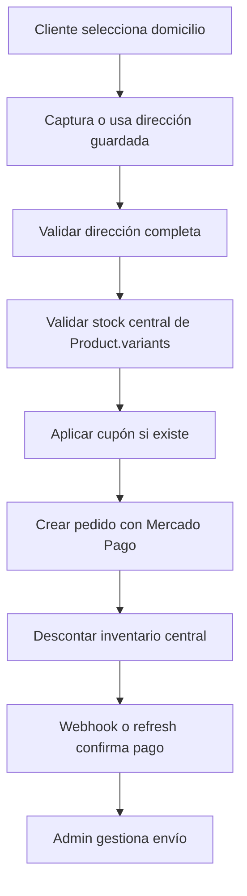
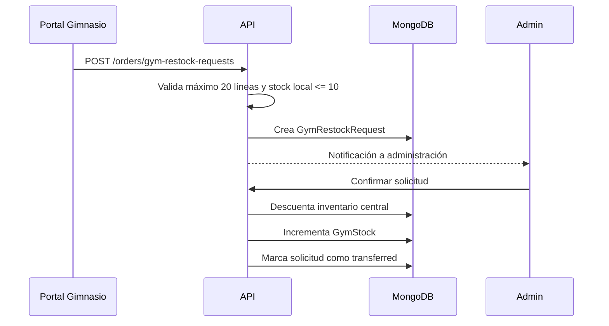
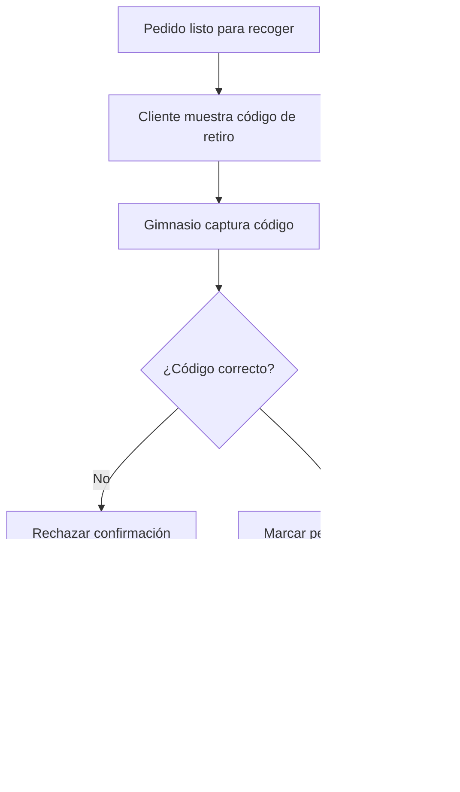
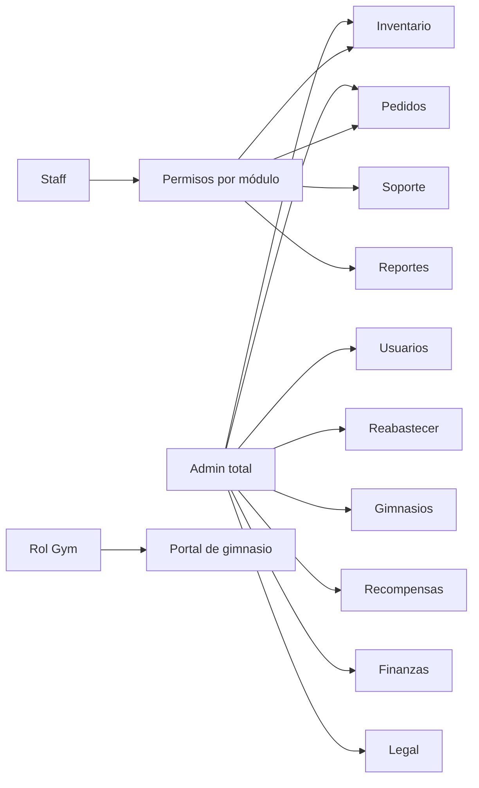

# Diagramas - GymVerse

**Fecha de actualización:** 26 de julio de 2026

## 1. Arquitectura general

```mermaid
flowchart LR
  Cliente["PWA Cliente (React/Vite)"] --> API["API GymVerse (Express)"]
  Admin["Panel Admin (React/Vite)"] --> API
  Gym["Portal Gimnasio"] --> API
  API --> Mongo["MongoDB"]
  API --> MP["Mercado Pago"]
  API --> Google["Google Login"]
  API --> Resend["Resend Email"]
  API --> Cloudinary["Cloudinary Imágenes"]
  MP --> Webhook["Webhook /orders/mercado-pago/webhook"]
  Webhook --> API
```

## 2. Flujo de registro e inicio de sesión

```mermaid
flowchart TD
  A["Usuario abre Auth"] --> B{"Modo"}
  B -->|Registro| C["Captura nombre, correo, teléfono y contraseña"]
  C --> D["Validar campos y contraseña fuerte"]
  D --> E["Crear usuario customer"]
  B -->|Login| F["Captura correo y contraseña"]
  F --> G["Validar credenciales y estado activo"]
  B -->|Google| H["Recibir credencial de Google"]
  H --> I["API valida token con GOOGLE_CLIENT_ID"]
  I --> J["Vincular o crear cuenta customer"]
  E --> K["Emitir JWT y perfil"]
  G --> K
  J --> K
```

## 3. Recuperación de contraseña

```mermaid
sequenceDiagram
  participant U as Usuario
  participant C as Cliente
  participant A as API
  participant R as Resend
  U->>C: Solicita código con correo
  C->>A: POST /auth/password-reset/request
  A->>A: Genera código de 6 dígitos y hash
  A->>R: Envía correo si está configurado
  U->>C: Captura código y nueva contraseña
  C->>A: POST /auth/password-reset/confirm
  A->>A: Valida código, intentos y contraseña
  A-->>C: Token y usuario actualizado
```

## 4. Afiliación de gimnasio

```mermaid
flowchart TD
  A["Cliente entra a Perfil > Gimnasios"] --> B["Busca gimnasio"]
  B --> C["API filtra gimnasios activos con retiro habilitado"]
  C --> D{"Cliente elige gimnasio"}
  D -->|Afiliar| E["Agregar gimnasio a affiliatedGyms"]
  D -->|Quitar| F["Eliminar gimnasio de affiliatedGyms"]
  E --> G["Gimnasio aparece como punto de retiro"]
  F --> H["Gimnasio deja de aparecer en nuevas compras"]
```

## 5. Compra con retiro en gimnasio

```mermaid
flowchart TD
  A["Cliente agrega productos"] --> B["Selecciona retiro en gimnasio"]
  B --> C{"¿Tiene gimnasio afiliado?"}
  C -->|No| D["Solicitar afiliación desde Perfil"]
  C -->|Sí| E["Consultar stock local GymStock"]
  E --> F{"¿Stock local suficiente?"}
  F -->|No| G["Bloquear confirmación o informar insuficiencia"]
  F -->|Sí| H["Crear pedido"]
  H --> I["Descontar GymStock"]
  I --> J{"Método de pago"}
  J -->|Mercado Pago| K["Crear preferencia y dejar pending_payment"]
  J -->|Pago al recoger| L["Pedido queda para pago en gimnasio"]
  K --> M["Gimnasio prepara y confirma con código"]
  L --> M
  M --> N["Pedido entregado y puntos otorgados"]
```

## 6. Compra con entrega a domicilio

```mermaid
flowchart TD
  A["Cliente selecciona domicilio"] --> B["Captura o usa dirección guardada"]
  B --> C["Validar dirección completa"]
  C --> D["Validar stock central de Product.variants"]
  D --> E["Aplicar cupón si existe"]
  E --> F["Crear pedido con Mercado Pago"]
  F --> G["Descontar inventario central"]
  G --> H["Webhook o refresh confirma pago"]
  H --> I["Admin gestiona envío"]
```

## 7. Reabastecimiento de gimnasio

```mermaid
sequenceDiagram
  participant G as Portal Gimnasio
  participant A as API
  participant M as MongoDB
  participant AD as Admin
  G->>A: POST /orders/gym-restock-requests
  A->>A: Valida máximo 20 líneas y stock local <= 10
  A->>M: Crea GymRestockRequest
  A-->>AD: Notificación a administración
  AD->>A: Confirmar solicitud
  A->>M: Descuenta inventario central
  A->>M: Incrementa GymStock
  A->>M: Marca solicitud como transferred
```

## 8. Confirmación de retiro

```mermaid
flowchart TD
  A["Pedido listo para recoger"] --> B["Cliente muestra código de retiro"]
  B --> C["Gimnasio captura código"]
  C --> D{"¿Código correcto?"}
  D -->|No| E["Rechazar confirmación"]
  D -->|Sí| F["Marcar pedido delivered"]
  F --> G["Si pago al recoger, marcar pago paid"]
  G --> H["Otorgar puntos una sola vez"]
```

## 9. Modelo de módulos administrativos

```mermaid
flowchart LR
  Admin["Admin total"] --> Users["Usuarios"]
  Admin --> Inventory["Inventario"]
  Admin --> Orders["Pedidos"]
  Admin --> Restock["Reabastecer"]
  Admin --> Gyms["Gimnasios"]
  Admin --> Rewards["Recompensas"]
  Admin --> Finance["Finanzas"]
  Admin --> Legal["Legal"]
  Staff["Staff"] --> Permissions["Permisos por módulo"]
  Permissions --> Inventory
  Permissions --> Orders
  Permissions --> Support["Soporte"]
  Permissions --> Reports["Reportes"]
  GymUser["Rol Gym"] --> GymPortal["Portal de gimnasio"]
```
